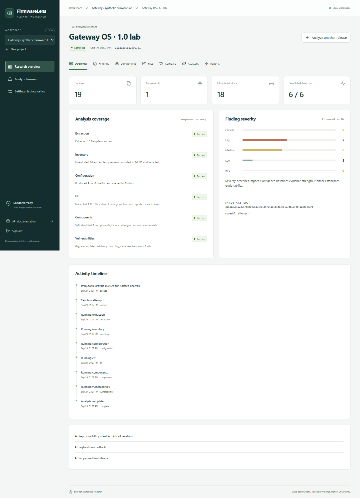
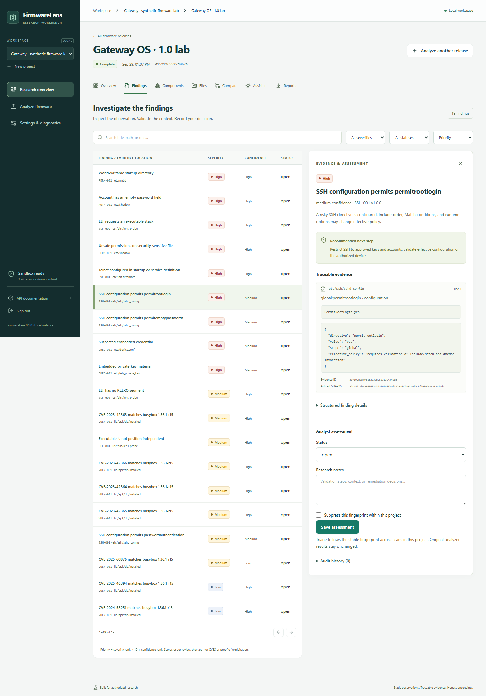
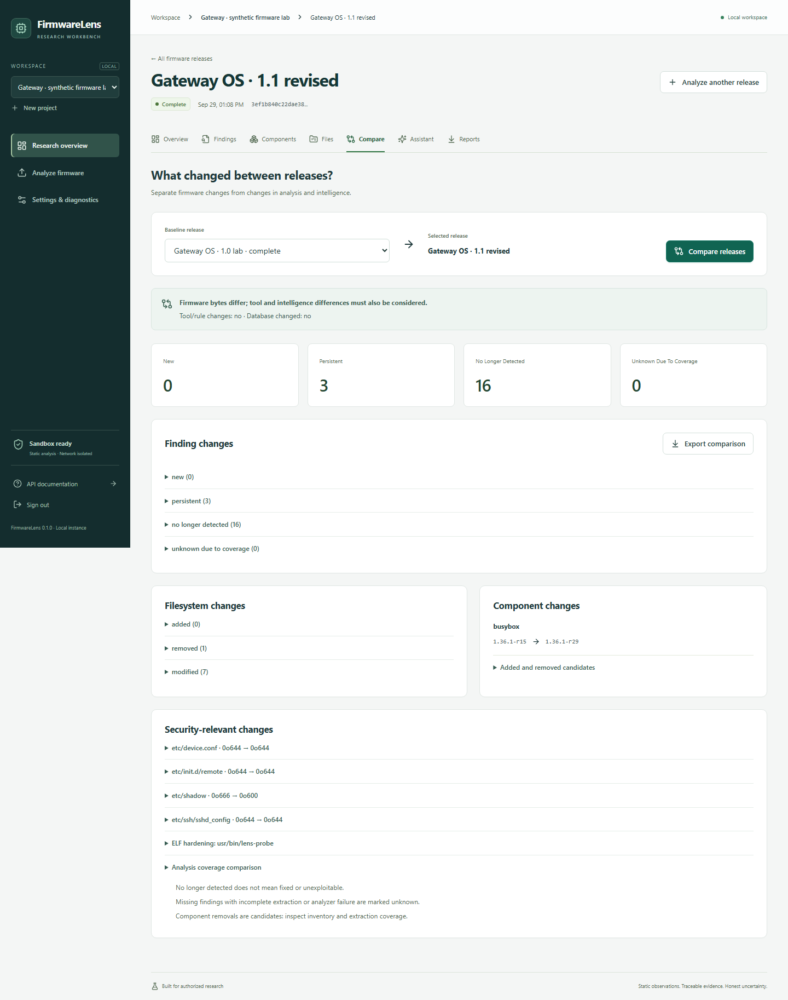

# FirmwareLens

**Firmware Vulnerability Researcher with an AI Assistant**

A local workbench for authorized Linux IoT firmware research. Upload a filesystem, follow the evidence behind each finding, compare releases, and export a report that records both the results and the analysis gaps.

FirmwareLens runs real SquashFS extraction, ELF inspection, Syft inventory and Grype advisory matching in disposable, network-isolated Linux containers. PostgreSQL preserves jobs, immutable results and analyst history. The browser and CLI use the same authenticated API and analysis pipeline.



## What it does

- Accepts raw and embedded SquashFS, tar, gzip tar, and ZIP bundles containing supported payloads. Checks signatures, paths, expansion budgets and original metadata.
- Produces file inventories, bounded redacted previews, components, a native Syft inventory and CycloneDX SBOMs.
- Finds risky authentication settings, configured Telnet startup, suspected credentials, sensitive permissions and ELF hardening weaknesses. Every finding links to parser evidence.
- Matches components against a prepared local Grype database, recording match details, confidence, fixes, database identity and freshness. A match does **not** establish exploitability.
- Supports analyst notes, status, suppression reasons/expiry, history, and coverage-aware release comparison.
- Offers an optional evidence-grounded assistant using OpenAI Responses or a configured Ollama model. AI is disabled by default; no model downloads occur automatically.
- Exports JSON, standalone HTML, Markdown, CycloneDX and SARIF. Includes a Typer CLI and local OpenAPI documentation.

## Quickstart

Use Docker Engine 26+ with Linux containers, cgroup v2, Compose, and Node 24 for the setup helper. Windows uses Docker Desktop with WSL2. The validated engine had 6 CPUs and 7.72 GiB RAM available; allow additional disk space for images and the advisory database. Docker Desktop storage can reside on `D:\Docker`: application data uses named volumes.

Run these commands from the repository root:

```sh
node scripts/setup.mjs
docker compose build
docker compose --profile tools build sandbox demo
docker compose up -d
docker compose exec api firmwarelens doctor --json
docker compose exec api firmwarelens access-token
```

Allow the supervisor's initial isolation self-test to finish before running `doctor`. Open **http://localhost:8080** and sign in with the displayed local token. The token is a credential: keep it local. Setup preserves an existing `.env` and generates a random database password on first use.

Initial builds require downloads. Scans have no network access. The API has no Docker socket; the trusted supervisor does, which is a host-privileged boundary described in the [threat model](docs/THREAT_MODEL.md).

## Run the source-built demo

```sh
docker compose --profile tools run --rm demo
docker compose exec api python scripts/demo_workflow.py
docker compose cp api:/exports/. ./exports
```

The builder compiles a small ELF fixture and packages two synthetic releases in seven input variants. The workflow submits ordinary uploads and jobs, prints a project URL, and writes reports and comparison data. It does not seed results.

Without advisory intelligence, scans finish **partial** with explicit missing-database diagnostics. Prepare real intelligence separately, then rerun the workflow for full advisory matching:

```sh
docker compose stop supervisor
docker compose --profile tools run --rm intelligence update
docker compose start supervisor
docker compose exec api python scripts/demo_workflow.py
docker compose cp api:/exports/. ./exports
```

After preparing dependencies, images, fixtures and optionally the database, the core demo works offline. [Operations](docs/OPERATIONS.md) covers offline imports, AI configuration, backup, retention and troubleshooting.

In the browser, open the generated project, select the lab release, and inspect the SSH finding's evidence. Acknowledge it with a research note, inspect the redacted configuration preview and component identity, then compare against the revised release. Export HTML from **Reports**. The assistant explains how to configure a provider when none is enabled.





## CLI workflow

```sh
docker compose exec api firmwarelens project create "CLI research" --json
# Substitute the returned project ID for PROJECT_ID:
docker compose exec api firmwarelens scan /demo/lab.tar --project PROJECT_ID --label lab --allow-partial --json
docker compose exec api firmwarelens scans list PROJECT_ID --json
# Substitute the returned scan ID for SCAN_ID:
docker compose exec api firmwarelens findings PROJECT_ID SCAN_ID --severity high --json
docker compose exec api firmwarelens report PROJECT_ID SCAN_ID /exports/research.html --format html
docker compose cp api:/exports/research.html ./exports/research.html
```

For automation, `--fail-on high` returns exit 3 for findings at/above that threshold, independently of exit 2 for a failed/unsupported/cancelled scan, exit 4 for partial coverage, or exit 5 for an unavailable service. `--allow-partial` accepts partial coverage explicitly. `--no-wait` submits a job; inspect its eventual outcome separately. See [API and CLI](docs/API_CLI.md). Read-only interactive API documentation is at `/api/docs`; the generated schema is `/api/openapi.json`.

## Verified results and limits

The latest [release audit](docs/RELEASE_READINESS.md) records passing functional tests and an unresolved container security gate: the PostgreSQL image retains a critical libxml2 advisory match. This is a research release with documented limitations, not a vulnerability-free or production-certified deployment.

On the recorded 2026-09-29 database, the synthetic lab produced **19 findings** and the revised release **3**, with 16 no longer detected and 3 persistent. Pipeline times were **15.252 s** and **10.052 s** in single measured runs. Seven input variants passed real extraction/inventory checks. A pinned OpenWrt 23.05.5 image was also analyzed with explicit partial extraction coverage. These are reproducible research examples, not accuracy or device exploitability claims.

The [validation record](docs/VALIDATION.md) separates measured checks from unverified behavior. Live OpenAI/Ollama responses require your provider configuration and have not been evaluated in this environment. Adapter, citation, scope and redaction tests use test doubles. Hosted GitHub Actions have not run. [Support matrix](docs/SUPPORT_MATRIX.md) and [limitations](docs/LIMITATIONS.md) describe parser coverage, unknowns and the roadmap.

## Development and project guide

```sh
uv sync --frozen
uv run pytest -q
uv run ruff check src tests scripts demo
uv run ruff format --check src tests scripts demo
uv run mypy src
cd frontend
npm ci
npx playwright install chromium firefox webkit
npm run lint
npm run build
npm run test:e2e
```

Browser checks require a running application and generated demo fixtures. On PowerShell use `npm.cmd` and `npx.cmd` if script execution is restricted. A container-only Python check runner and contribution guidance are in [CONTRIBUTING.md](CONTRIBUTING.md).

| Document | Purpose |
| --- | --- |
| [Architecture](docs/ARCHITECTURE.md) | Modules, job leases, trust boundaries and diagram |
| [Threat model](docs/THREAT_MODEL.md) / [Security policy](SECURITY.md) | Actual isolation controls and residual risks |
| [Analysis rules](docs/RULES.md) | Detection semantics, prioritization and uncertainty |
| [Support matrix](docs/SUPPORT_MATRIX.md) | Tested extraction and architecture variants |
| [Operations](docs/OPERATIONS.md) | Offline setup, AI, intelligence, backup and troubleshooting |
| [API / CLI](docs/API_CLI.md) | Endpoints, flags and exit codes |
| [Validation](docs/VALIDATION.md) / [Case study](docs/CASE_STUDY.md) | Measurements, evidence and CV bullets |
| [Status](STATUS.md) / [Changelog](CHANGELOG.md) | Release state and remaining verification |

Apache-2.0 for original project code. Dependencies, schema files, analyzer binaries and optional firmware retain their own licenses; see [third-party notices](THIRD_PARTY_NOTICES.md). Large firmware, databases, credentials and generated research artifacts are excluded from Git.
