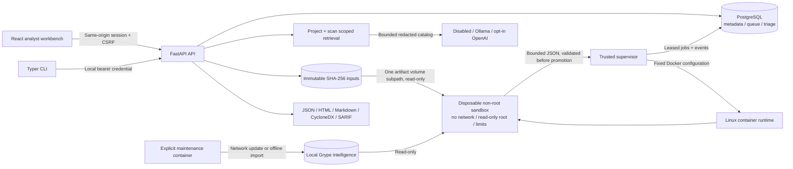

# Architecture and decisions

## Boundaries

The API has database and artifact access, but no Docker socket. The supervisor has the Docker socket and database credentials, but exposes no HTTP interface. Requests supply only validated artifact IDs and bounded scan options; they cannot choose a container image, mount, host path, or command. The supervisor chooses a locally built image by its resolved image ID, uses a fixed entrypoint, and mounts only the current artifact's named-volume subpath plus advisory intelligence. The sandbox receives no database credentials, provider keys, session tokens, or runtime socket.

The supervisor is a highly privileged trusted component: Docker socket access is effectively host administration. Dropped process capabilities do not remove that socket privilege. Use a dedicated research machine or VM, keep Docker patched, and do not expose the application beyond localhost without additional deployment work.

## Modular monolith

`schemas.py` is the source of truth for analysis contracts. `scripts/generate_types.py` produces the frontend analysis types. The API and CLI use the same pipeline through the durable queue. SQLite is limited to persistence tests; deployment uses PostgreSQL. A second queue broker would add operational complexity without a demonstrated need for this single-user release.

Original inputs are content-addressed, write-once files. Each submission can create a distinct scan; `Idempotency-Key` retries return the same scan and reject parameter changes. Analysis output is a bounded, validated JSON document in the scan row, with structured files, evidence, components, and findings. Triage is a separate project/fingerprint table with an append-only audit trail. The API cannot mutate analyzer results. The current JSON storage favors reproducibility and a simple backup; filtering loads a bounded result document and paginates in application memory. Large-scale indexing belongs in a later release.

## Jobs and recovery

PostgreSQL `FOR UPDATE SKIP LOCKED` claims one queued job. A lease token prevents stale workers from promoting results after ownership changes. Heartbeats extend the lease; stale jobs are retried up to two attempts. Cancellation is persisted, checked during execution, and removes the sandbox. SIGTERM queues interrupted work. Expired leases recover after 90 seconds; terminal failures remain visible. Stage events, errors, options, attempts and final outcomes survive application restart. Retry handling removes stale containers for its own job. Periodic cleanup reaps only containers with the application's label and exact job-derived name, while holding the job row lock and confirming no active lease remains.

## Extraction and analysis

Input signatures select tar, gzip tar, ZIP payloads or validated SquashFS v4 superblocks at embedded offsets. Python archive code manually creates regular files with safe local permissions; it never uses `extractall`. Links and special files retain inventory metadata but are not materialized in the sanitized analysis root. SquashFS extraction occurs only in the disposable sandbox, followed by safe inventory/copying. Original UID/GID/mode come from tar headers or numeric SquashFS listings. No firmware code runs.

Plugins declare ID, version, inputs and capabilities and consume validated limits. A Linux stage deadline bounds Python parsers; subprocess wrappers bound external tools and kill their process groups on timeout. The supervisor independently enforces the entire job deadline and validates output identity, paths, counts and evidence references.

Syft generates native inventory plus CycloneDX. Grype consumes that native inventory, never a hand-built package guess. Its ecosystem/distribution match details, advisory, fix/CVSS data, and evidence are retained. Binary cataloger identities are marked heuristic, and CPE candidates receive lower confidence. A missing database produces failed vulnerability-stage coverage, not an empty successful assessment. Fingerprints exclude file hash and package version so triage and comparisons persist across releases.

## Assistant

Retrieval is deterministic and read-only: selected findings, keyword overlap and severity choose a bounded catalog within a selected scan. Components, evidence and an optional same-project comparison supplement it. The model receives no execution, SQL, filesystem or web-fetch tools. OpenAI uses the official SDK's `responses.parse`, typed output and `store=False`; Ollama uses `/api/chat` with a JSON schema. Cloud use needs explicit server configuration.

Every model citation must resolve inside the supplied catalog. Observations must exactly quote a catalog fact. Interpretations/hypotheses require citations and remain analyst-reviewed; syntactically valid citations are not a proof of semantic entailment. Provider errors, context and output caps, request timeout, cancellation, daily usage reservations, and conversation history are implemented. Live provider quality must be evaluated with your selected model; test doubles are only in tests.

## Sources checked during implementation

- [OpenAI structured outputs and Responses parsing](https://developers.openai.com/api/docs/guides/structured-outputs)
- [Docker runtime isolation and limits](https://docs.docker.com/engine/containers/run/)
- [Docker tmpfs behavior](https://docs.docker.com/engine/storage/tmpfs/)
- [Syft directory scanning](https://oss.anchore.com/docs/guides/sbom/scan-targets/)
- [Grype SBOM scanning](https://oss.anchore.com/docs/guides/vulnerability/scan-targets/)
- [Grype database management](https://oss.anchore.com/docs/guides/vulnerability/database/)
- [Ollama structured chat request](https://docs.ollama.com/api/chat)
